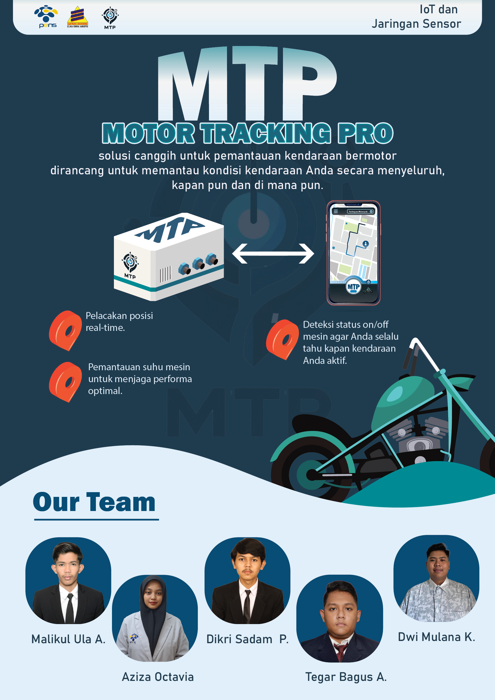
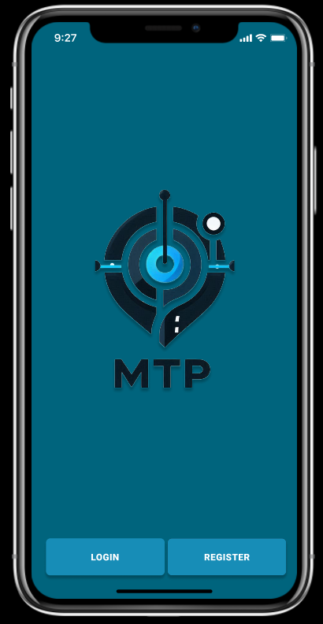
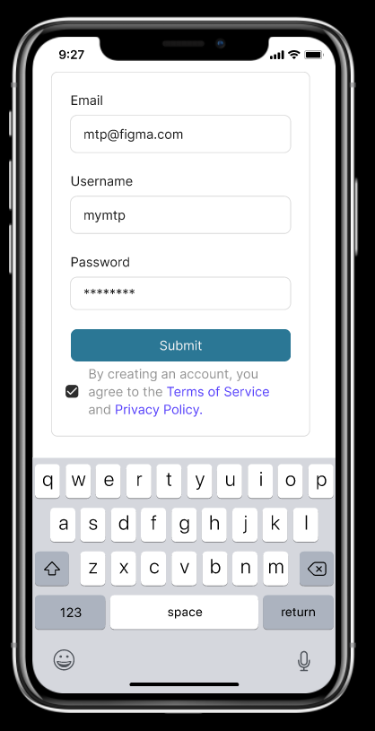

# Flyer MTP

  

# MTP-Motor-TrackerPro-

  

## Optimalisasi Operasional dengan
Pelacakan Realtime dan Kesehatan
Kendaraan berbasis ESP 32

MTP atau Motor Tracker Pro adalah perangkat pelacak motor canggih yang terhubung langsung dengan smartphone Anda, dirancang untuk memberikan kontrol dan pemantauan penuh terhadap kendaraan Anda. Fungsi utamanya adalah melacak lokasi motor secara real-time dan mencatat waktu setiap lokasi dikirimkan, sehingga Anda dapat memonitor pergerakan kendaraan dengan mudah.

Dengan teknologi IoT, aplikasi Motor Tracker Pro memungkinkan pengguna untuk menghidupkan motor dan mengunci starter secara cerdas melalui smartphone, memberikan kontrol penuh atas keamanan motor Anda kapan pun dibutuhkan. Selain itu, aplikasi ini menampilkan informasi lengkap tentang suhu dan kelembapan mesin, memungkinkan pengguna memantau kondisi mesin dan memastikan performa tetap optimal. Motor Tracker Pro memberikan pengalaman monitoring motor yang aman, praktis, dan terintegrasi.

## Manfaat
Motor Tracker Pro memberikan berbagai manfaat yang signifikan bagi penggunanya, terutama dalam hal keamanan dan kenyamanan. Berikut beberapa manfaat utama dari alat ini:

1. **Keamanan Motor yang Lebih Terjamin**  
   Dengan pelacakan lokasi real-time dan pemberitahuan waktu lokasi dikirim, Anda dapat memantau posisi motor kapan saja, mengurangi risiko pencurian. Fitur penguncian jarak jauh melalui aplikasi juga menambah lapisan keamanan ekstra.

2. **Pengoperasian Motor yang Lebih Mudah dan Fleksibel**  
   Fitur IoT memungkinkan Anda menghidupkan motor atau mengunci starter melalui smartphone. Manfaat ini berguna saat Anda ingin memanaskan motor dari jarak jauh atau mengunci motor dengan cepat jika terjadi hal yang mencurigakan.

3. **Pemantauan Kondisi Mesin untuk Perawatan yang Lebih Baik**  
   Informasi suhu dan kelembapan mesin yang ditampilkan di aplikasi membantu Anda memantau kondisi motor, sehingga Anda bisa mengetahui tanda-tanda awal jika ada masalah pada mesin, seperti potensi overheating atau kelembapan yang berlebihan, yang dapat memengaruhi performa.

4. **Efisiensi Waktu dan Praktis**  
   Dengan kendali motor yang ada di smartphone, Anda dapat mengakses motor kapan saja dan dari mana saja tanpa perlu berada di dekatnya. Ini sangat berguna untuk pengguna yang sering bepergian atau parkir di tempat umum.

5. **Pemantauan Rute dan Riwayat Lokasi**  
   Motor Tracker Pro membantu Anda melacak riwayat pergerakan motor, sehingga Anda dapat mengidentifikasi rute yang telah dilalui. Hal ini berguna untuk memantau penggunaan motor oleh orang lain atau mengetahui area mana yang lebih sering dilalui.

6. **Pengalaman Berkendara yang Lebih Tenang**  
   Dengan fitur keamanan dan monitoring yang lengkap, Anda dapat lebih tenang dan merasa aman saat meninggalkan motor di tempat parkir atau saat motor dipinjam oleh orang lain.

Motor Tracker Pro adalah solusi lengkap untuk pemantauan, keamanan, dan perawatan motor yang modern dan praktis, menjadikan kendaraan Anda lebih aman dan nyaman.

## Support By :
>- Dosen Pengampu : Akhmad Hendriawan ST., MT. (NIP.197501272002121003)
>- Mata kuliah : IoT dan Jaringan Sensor
>- Program Studi : D4 Teknik Elektronika
>- Politeknik Elektronika Negeri Surabaya 

## Team Member :
|      NRP      |       Nama      |    Jobdesk    |   Akun |
| :-----------:|:----------------:| :------------:| :-----:|
| 2122500038    | Malikul ula Al Farizi  | Project Manager       | [Malikul18] (https://github.com/Malikul18)
| 2122500041    | Tegar Bagus Aditya         |   Programmer  | [LEEEOOONNN] (https://github.com/LEEEOOONNN)
| 2122500047    | Aziza Octavia         |    UI/UX Designer      | [Azizaoct] (https://github.com/Azizaoct)
| 2122500049    | Dikri Sadam Panca Sakti                | Hardware | [DKRSDMPNCSKT] (https://github.com/DKRSDMPNCSKT)
| 2122500054    | Dwie Maulana Kalyana               | Data Analist     | [Dwiemaulana] (https://github.com/Dwiemaulana)

#Daftar Isi
- [Komponen](#Komponen)
- [Diagram Arsitektur Sistem](#Diagram-Arsitektur-Sistem)
- [Hardware](#Hardware)
- [Software](#Software)
- [Desain Prototype](#Desain-Prototype)
   * [Desain UI/UX MTP](#Desain-UI/UX-MTP)
- [Rincian Biaya](#Rincian-Biaya)

# Komponen
1. ESP32
2. Relay 2 Channel
3. Sensor GPS Neo-6M
4. RTC
5. DHT22
6. Module Step-Down

# Diagram Arsitektur Sistem
....(Coming Soon)....

# Hardware
....(Coming Soon)....

# Software
....(Coming Soon)....

# Desain Prototype
## Desain UI/UX MTP
Tampilan awal UI/UX MTP      |   
 | | 
 | 
- [Figma](https://www.figma.com/design/K79DKEpYAUl1oy9ZEVzn8G/Prototyping-in-Figma?node-id=0-1&node-type=canvas&t=O9agAbHADH6BsXUb-0)
- Prototype *MTP* menggunakan Figma untuk UI/UX adalah sebuah desain antarmuka interaktif yang bertujuan untuk memvisualisasikan konsep dan alur pengguna dari sebuah aplikasi atau sistem yang sedang dikembangkan. Prototipe ini memungkinkan pengguna atau pemangku kepentingan untuk memahami bagaimana aplikasi akan berfungsi, termasuk navigasi, tata letak, dan interaksi antar elemen di dalamnya. Dalam Figma, prototipe *MTP* dapat mencakup elemen-elemen seperti tombol, form input, menu, serta transisi antar halaman atau skenario pengguna.

# Rincian Biaya
| No  | Item                   | Jumlah | Harga   | Total   |
|-----|------------------------|--------|---------|---------|
| 1   | ESP32 Devkitc 32D      | 1      | 66.900  | 66.900  |
| 2   | 2 Channel Relay Module 5V/3.3V    | 1     | 15.000   | 15.000   |
| 3   | GPS Module Ublox NEO 6M V2          | 1      | 74.500     | 74.500     |
| 4   | Tinny RTC DS1307          | 1      | 10.000  | 10.000  |
| 5   | DHT22 Module Sensor      | 1      | 70.000     | 70.000     |
| 6   | Project Board Power Module      | 1      | 12.000   | 12.000   |
| 7   | 3D Print Casing        | -      | -  | -  |
|     |                        |        |         |         |
